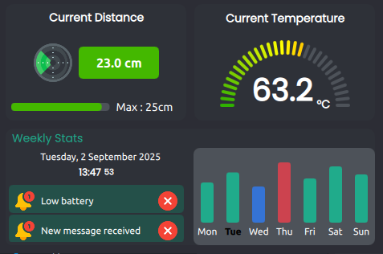
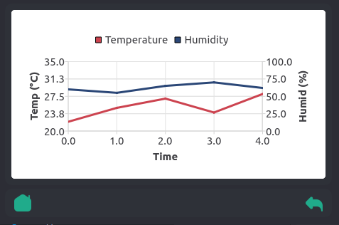
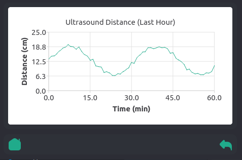
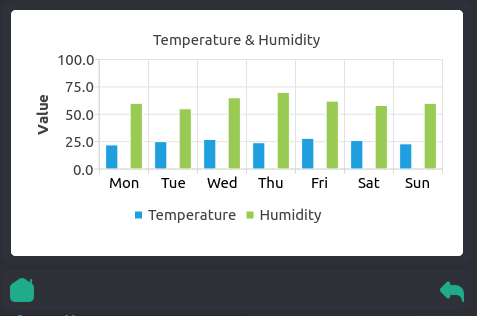

# SensorPi

SensorPi is a modern **Qt/QML desktop application** for visualizing and monitoring sensor data such as temperature, humidity, distance, and weekly statistics.  
It features a responsive dashboard, interactive charts, and a clean, touch-friendly interface.

---

## ✨ Features

- **Dashboard Home**: Quick overview of temperature, distance, and weekly stats.
- **Temperature & Humidity**: Real-time readings with gauges and charts.
- **Distance Monitoring**: Progress indicators with visual gauges.
- **Weekly Statistics**: Interactive charts and notification list.
- **Custom Components**: Bottom navigation bar, clock, notifications, etc.
- **Splash Screen**: Animated startup experience.
- **Theming**: Centralized style, colors, and font management.

---

## 📂 Project Structure

```

.
├── main.cpp          # Application entry point (C++)
├── main.qml          # Main QML application window
├── Style.qml         # Centralized style and color definitions
├── Components/       # Reusable QML components (Clock, BottomBar, etc.)
├── Screens/          # Application screens (HomePage, SplashScreen, etc.)
├── images/           # UI images and icons
├── fonts/            # Embedded fonts (Poppins, etc.)
├── resources.qrc     # Qt resource collection file
├── CMakeLists.txt    # CMake build configuration
├── sensorpi.pro      # Qt project file (alternative to CMake)
├── src/              # C++ headers (e.g., globals.h)
├── captures/         # Screenshots of the UI
└── README.md         # Project documentation

````

---

## 🖼️ Screenshots

### Dashboard Home  


### Temperature & Humidity  


### Distance Monitoring  


### Weekly Statistics  


---

## 🚀 Getting Started

### Prerequisites

- **Qt 6.6+** (with Qt Quick, QML, Charts modules)
- **CMake 3.16+** or **Qt Creator**
- **C++17** compatible compiler

### Build Instructions

#### Using CMake
```sh
git clone <repository-url>
cd sensorpi
cmake -B build -S .
cmake --build build
./build/sensorpi
````

#### Using Qt Creator

1. Open `sensorpi.pro` or `CMakeLists.txt` in Qt Creator.
2. Configure the project.
3. Click **Run** to start the app.

---

## 🎨 Customization

* **UI Components** → `Components/` and `Screens/`
* **Assets (images/fonts)** → `images/` or `fonts/` (update `resources.qrc`)
* **Styling/Theming** → `Style.qml`

---

## 📜 License

This project is licensed under the **MIT License**.

---

**SensorPi** — A modern sensor dashboard built with Qt and QML.